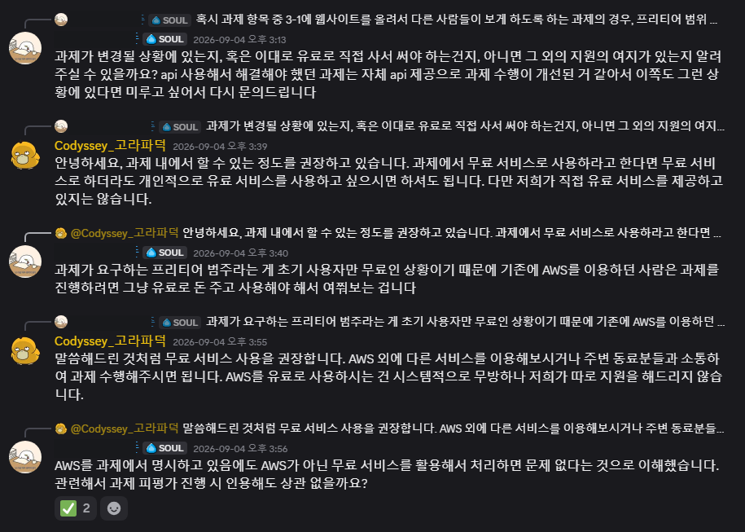
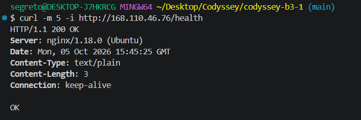
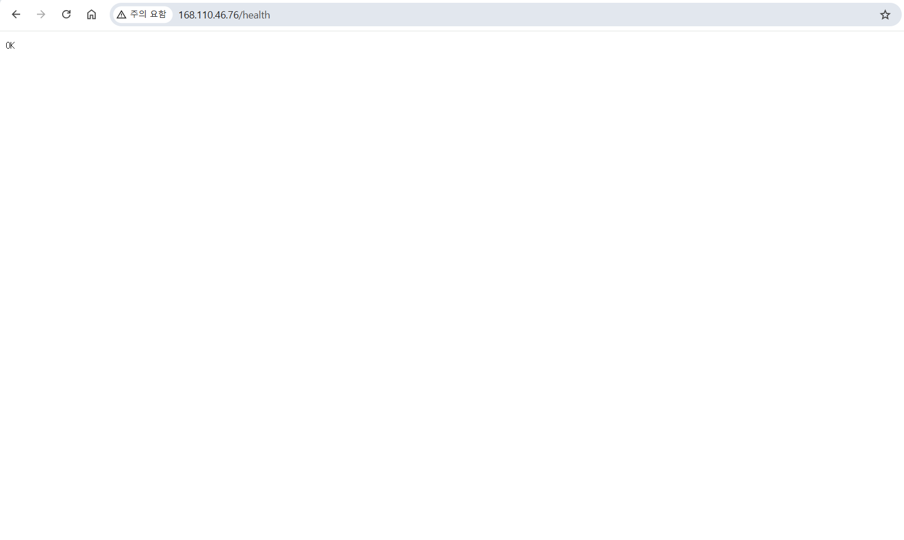
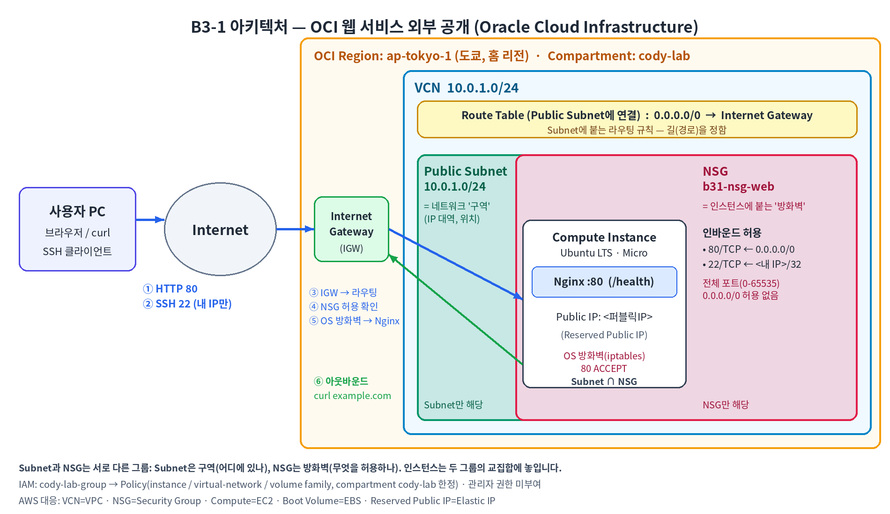

<div align="center">

# ☁️ 내가 만든 웹사이트를 인터넷에 올려 누구나 쓰게 하기

### VCN 격리 네트워크 · NSG 최소 개방 · IAM 최소권한 · Nginx 외부 공개 · 리소스 정리까지

  

</div>

> "서버를 올렸는데 외부에서 안 들어와요"를 **경로(라우팅) → 방화벽(NSG) → OS 방화벽 → 서버** 순서로 스스로 진단할 수 있게 만드는 것이 목표입니다.

**미션**: B3-1 · 내가 만든 웹사이트를 인터넷에 올려 누구나 쓰게 하기 (클라우드와 AI API)

## 프로젝트 개요
Oracle Cloud Infrastructure(OCI)에 VCN을 직접 설계하고, Public Subnet의 Compute Instance에 Nginx를 배포해 외부에서 접속 가능한 웹 서비스를 완성했습니다. "열린 포트 하나"가 사고로 이어질 수 있다는 점을 기준으로, 필요한 포트만 열고(80은 전체, 22는 내 IP만) 권한도 실습 범위로 좁혔습니다.

**클라우드 선택 근거:** 명세는 AWS 기준이지만, AWS 프리티어는 신규 가입자 한정이라 OCI Always Free(도쿄 홈 리전)로 수행했습니다. 같은 사유로 다른 수강생이 `올인원_support` 채널에 문의했고(2026.09.04), 코디세이 운영진(`Codyssey_고라파덕`)이 오후 3:55에 "AWS 외에 다른 서비스를 이용해보시거나 주변 동료분들과 소통하여 과제 수행해주시면 됩니다"라고 답변했습니다. 같은 답변에서 무료 서비스 사용을 권장한다고 안내했습니다. 근거 캡처는 `docs/support-notice.png`에 있어요.



| AWS | OCI (본 과제) |
|---|---|
| VPC | VCN |
| Security Group | NSG |
| EC2 | Compute Instance |
| EBS | Boot Volume |
| Elastic IP | Reserved Public IP |
| IAM 최소권한 | IAM 사용자 + Policy (Compartment 범위) |

## 주요 기능
| 영역 | 구성 | 확인 방법 |
|---|---|---|
| 네트워크 | VCN `10.0.1.0/24`, Public Subnet `10.0.1.0/24`, Internet Gateway, Route Table `0.0.0.0/0 → IGW` | 인스턴스에서 `curl -I https://example.com` |
| 컴퓨트 | Compute Instance 1대 (Always Free Micro), SSH 접속 | `ssh -i ~/.ssh/ssh-key-*.key ubuntu@168.110.46.76` (캡처 17) |
| 웹 서버 | Nginx 실행, `/health`가 고정 응답 반환 | `curl -i http://localhost/health` → `200 OK` |
| 접근 제어 | NSG: 80/TCP `0.0.0.0/0`, 22/TCP 내 공인 IP(`/32`)만 허용 | 콘솔의 NSG 규칙 화면 (캡처 14) |
| 권한 | IAM 사용자 1명, 실습 범위 Policy, 관리자 권한 없음 | Policy 문장 (아래 학습 목표 참고) |
| 리소스 관리 | 이름 규칙 `b31-*` + 컴파트먼트 `cody-lab` | 콘솔 리소스 목록의 컴파트먼트 필터 |
| 정리 | 필수 5종(Instance/Boot Volume/Reserved IP/IGW/VCN) 삭제 체크리스트 | `docs/cleanup-checklist.md` (캡처 25~38) |

## 개발 환경
- 클라우드: Oracle Cloud Infrastructure (Always Free), 리전 `ap-tokyo-1` (도쿄, 홈 리전)
- 인스턴스: `VM.Standard.E2.1.Micro` 1대 (상시 무료 적격 표시 확인), Ubuntu 22.04 LTS
- 스토리지: 명세의 8~10GiB는 AWS EBS 기준 예시이고, OCI는 콘솔 기본 부트 볼륨 크기(47GB)로 생성했습니다. 임의로 증설하지 않았습니다.
- 웹 서버: Nginx
- 외부 라이브러리: 없음 (OS 패키지 `nginx`, `iptables-persistent`만 사용)
- 계정: 테넌시 관리자 계정은 IAM 설정(컴파트먼트, 그룹, 사용자, Policy)에만 쓰고, 이후 콘솔 작업은 IAM 사용자(`cody-lab-group` 소속)로 수행했습니다. 권한은 `cody-lab` 컴파트먼트로 한정했습니다. (로그인 계정 확인: `docs/screenshots/39-iam-user-login.png`)

## 배포 & 실행 방법
- GitHub 저장소: https://github.com/segretoo/codyssey-b3-1
- **외부 접속 검증 방식: B — `GET http://168.110.46.76/health`**
- 접속 정보: `http://168.110.46.76/health` → `200 OK` / 본문 `OK`
- 안내: 실습 종료 후 과금 방지를 위해 모든 리소스를 삭제했으므로 현재는 접속할 수 없습니다. 접속 결과는 스크린샷(`docs/screenshots/`)으로 확인할 수 있습니다.
- 고정 IP: Reserved Public IP를 인스턴스에 연결해 사용 (정리 체크리스트의 EIP 대응 항목)

```bash
# 1) SSH 접속 (개인 키는 레포 밖 ~/.ssh 에 보관, 권한 제한)
chmod 400 ~/.ssh/ssh-key-*.key
ssh -i ~/.ssh/ssh-key-*.key ubuntu@168.110.46.76

# 2) Nginx 설치·실행
sudo apt update && sudo apt install -y nginx
sudo systemctl enable --now nginx

# 3) /health 엔드포인트 추가 (기본 사이트 설정을 교체)
sudo tee /etc/nginx/sites-available/default >/dev/null <<'EOF'
server {
    listen 80 default_server;
    listen [::]:80 default_server;
    root /var/www/html;
    index index.html index.htm index.nginx-debian.html;
    server_name _;

    location = /health {
        default_type text/plain;
        return 200 "OK\n";
    }

    location / {
        try_files $uri $uri/ =404;
    }
}
EOF
sudo nginx -t && sudo systemctl reload nginx

# 4) OS 방화벽에서 80 허용 (OCI Ubuntu 이미지는 기본적으로 80을 차단)
sudo iptables -I INPUT -p tcp --dport 80 -m state --state NEW -j ACCEPT
sudo apt install -y iptables-persistent && sudo netfilter-persistent save

# 5) 검증
curl -i http://localhost/health                # 인스턴스 내부
curl -I https://example.com                    # 아웃바운드
curl -i http://168.110.46.76/health            # 내 PC에서 (외부)
```





## 프로젝트 구조
```
codyssey-b3-1/
├── .gitignore
├── README.md
└── docs/
    ├── architecture.png
    ├── troubleshooting.md
    ├── cleanup-checklist.md
    ├── support-notice.png
    ├── logs/
    └── screenshots/
```
- `.gitignore`: SSH 키 파일(`*.key`, `*.pem`)이 레포에 올라가지 않도록 차단
- `docs/support-notice.png`: AWS 외 서비스 사용에 대한 운영진 답변 캡처 (다른 참가자 닉네임은 가림)
- `docs/logs/`: SSH 접속, Nginx 설정, 외부 접속 타임아웃 터미널 로그
- `docs/screenshots/`: 01~24번(IAM·네트워크·접속·트러블슈팅 증빙), 25~38번(리소스 정리 증빙), 39번(IAM 사용자 로그인 확인), 40번(비용 분석 확인)



## 학습 목표 & 설명

**Q. 외부 → IGW → Subnet → 인스턴스 흐름은 어떻게 되고, Route Table의 `0.0.0.0/0 → IGW`는 왜 필요한가요?**
**"길(Route Table)이 문(IGW)으로 이어져야 Subnet이 인터넷과 통신하는 Public Subnet이 된다"**고 설명합니다.

- 흐름: 사용자 → 인터넷 → `IGW` → Route Table → `Public Subnet` → 퍼블릭 IP가 붙은 인스턴스 (다이어그램 ①~⑥)
- `VCN`: 내 전용 사설 네트워크 `10.0.1.0/24`, `Subnet`: 그 안의 구역 `10.0.1.0/24` (서브넷이 1개뿐이라 VCN 대역 전체를 서브넷에 사용)
- 기본 경로가 없으면 퍼블릭 IP가 있어도 응답 패킷이 나갈 길이 없어 **사실상 Private Subnet**이 됨
- `0.0.0.0/0`은 "VCN 내부가 아닌 모든 목적지"의 기본값이라, 한 줄로 인터넷 방향 전체를 IGW로 보냄

**Q. NSG 규칙은 어떤 기준으로 최소화했나요?**
**"서비스에 꼭 필요한 포트만 열고, 나머지는 기본 거부"**로 최소화했습니다.

- 허용: `80/TCP` ← `0.0.0.0/0` (누구나 웹 접속), `22/TCP` ← 내 공인 IP(`/32`) (관리용)
- 미허용: 443(HTTPS 미구성), 3306 등 DB 포트, 전체 포트 범위(0-65535), ICMP 전체 개방
- 인바운드는 허용 목록 방식이라 규칙에 없는 포트는 자동 차단

**Q. 외부 접속 검증은 A와 B 중 무엇을 골랐고, 무엇을 구성했나요?**
**"B(`/health` 고정 응답)"**를 선택했습니다.

- 이유: 페이지 내용이 바뀌어도 판정이 변하지 않고, `200` + 고정 본문으로 기계적으로 검증 가능
- 이유: 나중에 인스턴스를 늘릴 때 로드밸런서 헬스체크 경로로 그대로 재사용 가능
- 구성: Nginx `server` 블록에 `location = /health { default_type text/plain; return 200 "OK\n"; }` 추가 후 `nginx -t` → `reload`
- 검증: 내부 `curl localhost/health` → 외부 `curl http://168.110.46.76/health`

**Q. 실습 리소스를 추적하고 정리하기 위해 어떤 기준을 썼나요?**
**"이름 규칙 + 컴파트먼트 + 정리 체크리스트"** 세 가지를 함께 썼습니다.

- 이름 규칙: 모든 리소스에 `b31-` 접두사 (`b31-vcn`, `b31-subnet-public`, `b31-igw`, `b31-rt-public`, `b31-nsg-web`, `b31-web-01`)
- 컴파트먼트: 모든 리소스를 `cody-lab`에 생성해, 컴파트먼트 필터 하나로 조회·정리·비용 추적
- 체크리스트: 의존 관계의 안쪽부터 삭제하고 항목마다 근거 캡처 (`docs/cleanup-checklist.md`)

**Q. NSG와 IAM은 책임 범위가 어떻게 다르고, 최소권한은 왜 필요한가요?**
**"NSG는 네트워크 트래픽을, IAM은 사람과 서비스가 콘솔/API로 하는 행위를 통제"**합니다.

- `NSG`: 어떤 IP가 어떤 포트로 들어오는지 (네트워크 계층)
- `IAM`: 누가 어떤 리소스를 만들고 지울 수 있는지 (관리 계층)
- 최소권한이 필요한 이유: 계정 유출이나 실수가 나도 **피해 범위(사고 반경)가 Compartment 안으로 한정**됨
- 적용: `cody-lab` Compartment 한정, 관리자 그룹 미사용

```
Allow group cody-lab-group to manage instance-family in compartment cody-lab
Allow group cody-lab-group to manage virtual-network-family in compartment cody-lab
Allow group cody-lab-group to manage volume-family in compartment cody-lab
```

**Q. SSH(22)나 DB 포트를 `0.0.0.0/0`으로 열면 왜 안 되고, 대안은 무엇인가요?**
**"전 세계 스캐너의 무차별 대입과 취약점 공격 대상이 되기 때문"**입니다.

- SSH를 열어두면 수 분 안에 로그인 시도가 몰리고, DB 포트는 데이터 직접 유출로 이어짐
- 대안 1: 소스를 내 공인 IP(`/32`)로 제한 (본 과제 적용)
- 대안 2: DB는 Private Subnet에 두고 앱 서버 NSG에서 온 트래픽만 허용
- 대안 3: OCI Bastion 서비스나 VPN으로 접속 경로를 한 곳으로 모음, 키 인증만 사용(비밀번호 로그인 금지)

**Q. 외부 접속이 안 될 때 어떤 순서로 점검하고, 왜 가설 → 검증 순서를 지켰나요?**
**"라우팅 → NSG → 퍼블릭 IP/DNS → 서버 프로세스/로그 순으로, 가설 하나당 검증 하나"**로 점검합니다.

- 라우팅: Route Table의 `0.0.0.0/0 → IGW`, Subnet 연결
- NSG: 80/TCP 인바운드와 소스 범위
- 퍼블릭 IP/DNS: 인스턴스에 퍼블릭 IP가 붙었는지, 접속 주소가 맞는지
- 서버: `systemctl status nginx`, `curl localhost/health`, OS 방화벽(`iptables -L INPUT -n -v`)
- 순서를 지킨 이유: 한 번에 여러 개를 바꾸면 **무엇이 원인이었는지 알 수 없기 때문**
- 로그 활용: `nginx access.log`에 요청이 찍히지 않으면 Nginx 앞단(OS 방화벽 등)에서 막힌 근거가 됨
- 상세 기록: `docs/troubleshooting.md`

**Q. IAM 권한이 부족해 작업이 실패하면 필요한 최소 범위를 어떻게 찾나요?**
**"권한을 올리기 전에 에러가 가리키는 리소스와 동작을 확인하고, 가장 낮은 동작부터 추가"**합니다.

- 에러 메시지에서 어떤 리소스 타입과 동작이 막혔는지 확인 (`NotAuthorizedOrNotFound` 등)
- Audit 로그로 실패한 요청의 대상과 호출을 확인
- OCI 동작 단계는 `inspect` < `read` < `use` < `manage`라, 가장 낮은 단계부터 시도
- 범위는 Compartment에 고정하고 `Administrators` 그룹이나 테넌시 전체 권한은 피함

**Q. 트래픽이 늘어 인스턴스를 2대로 늘리면 무엇이 병목이고, 무엇을 추가하나요?**
**"단일 인스턴스와 단일 퍼블릭 IP가 병목이고, 앞단에 로드밸런서를 추가"**합니다.

- 병목 1: 인스턴스 1대가 SPOF(장애 시 서비스 중단), Micro 사양은 CPU/메모리 여유가 작음
- 병목 2: 사용자가 인스턴스 퍼블릭 IP에 직접 붙는 구조라 분산 불가
- 추가: OCI Load Balancer(ALB 대응), 인스턴스는 Private Subnet으로 옮기고 LB만 외부에 노출
- 헬스체크: 이번에 만든 `/health`를 그대로 사용
- 추가 고려: 세션/파일 같은 상태를 인스턴스 밖으로 분리

**Q. Billing에 예상치 못한 비용이 찍히면 어떤 순서로 의심하고 정리하나요?**
**"켜져 있는 것 → 남아 있는 것 → 따로 붙는 것 순서로, 컴파트먼트와 Cost Analysis로 추적"**합니다.

- 1순위: 실행 중인 인스턴스 (Always Free 셰이프/한도 초과 여부)
- 2순위: 삭제 후 남은 Boot/Block Volume
- 3순위: 미해제 Reserved Public IP, Load Balancer, NAT Gateway 등 부가 리소스
- 추적: Cost Analysis에서 Compartment(`cody-lab`)별로 그룹핑, Tenancy Explorer나 VCN 삭제 스캔으로 남은 리소스 조회
- 정리: `docs/cleanup-checklist.md` 순서대로 삭제하고 하루 뒤 재확인

## 배운 것 & 마무리
> 이 프로젝트를 통해 답할 수 있게 된 질문: **"서버는 떠 있는데 왜 외부에서 안 들어와지는가?"**

**네트워크** — VCN, Subnet, Route Table, IGW, 퍼블릭 IP / **보안** — NSG 최소 개방, OS 방화벽, IAM 최소권한 / **운영** — 헬스체크, 로그 기반 트러블슈팅, 과금 방지 정리

## 참고 / 트러블슈팅
- Always Free 인스턴스는 홈 리전에서만 만들 수 있고, 유휴 상태면 회수될 수 있어요. 홈 리전은 가입 시 도쿄로 지정했습니다. (가입 때 홈 리전 선택 목록에 서울이 없었음)
- NSG를 열어도 OS 방화벽이 막으면 외부 접속이 안 됩니다. 상세 사례: `docs/troubleshooting.md`
- VCN 생성 시 기본 보안 목록에 있던 22번 포트 허용 규칙을 삭제하고, SSH는 NSG에서 내 IP(`/32`)만 허용했습니다. (캡처 11)
- 정리 중 경로 테이블 규칙이 IGW를 참조해 IGW 종료가 막히는 오류를 겪었고, 규칙을 먼저 제거한 뒤 IGW를 삭제했습니다. (캡처 29~32)
- 실습 종료 후 `docs/cleanup-checklist.md` 순서대로 전부 삭제했고, 단계별 근거는 캡처 25~38번에 있습니다.
- 삭제 후 Cost Analysis(2026-10-01~06 UTC, 테넌시 전체)에서 누계 SGD 0.03(Block Storage, 10/05 하루분)이 확인됐고, 삭제 이후 날짜는 0.00입니다. (캡처 40, 사용량 데이터는 최대 24시간 지연될 수 있음)
